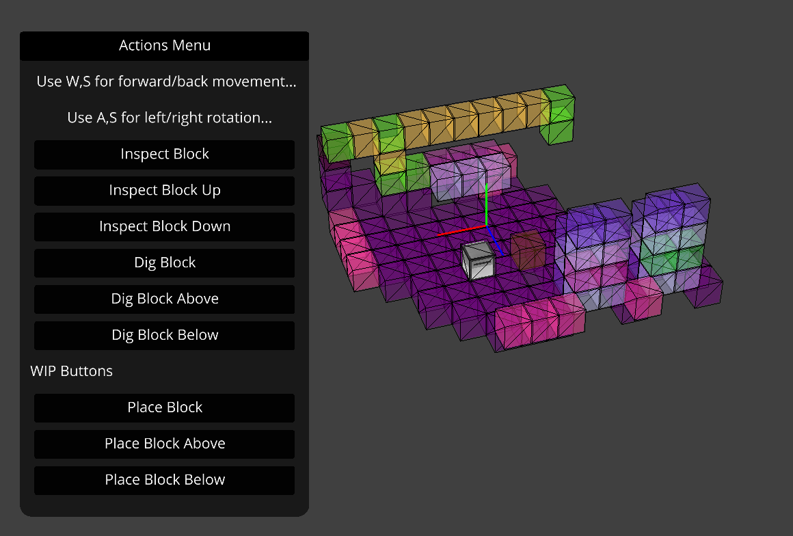

# Interactive 3D Mapping &mdash; ComputerCraft Turtle Environment

This program displays a 3D application aimed at connecting to a ComputerCraft turtle via a local websocket server and giving the user the ability to interactively map out and explore the environment around the turtle.

## Libraries Used:
- [Ursina - Game Engine written in Python](https://github.com/pokepetter/ursina)
  - [Documentation](https://www.ursinaengine.org/documentation.html)
  - [API Reference](https://www.ursinaengine.org/api_reference.html)
- [Websockets](https://pypi.org/project/websockets/)

## How to Run:
1. Install the pip requirements in `requirements.txt` by running `pip install -r requirements.txt`
2. Run the `main.py` script to start the 3D application and websocket server.
3. Place your ComputerCraft turtle in-game facing north.
   1. It is important to make sure that your turtle is facing north, as this ensures that the 3D environment is accurately mapped around the turtle.
4. Connect your in-game ComputerCraft turtle to the server using one of two methods linked below and run the script.
   1. Command for pastebin: `pastebin get 39M0XxZp` (Optional `websocket.lua` if you want to change the script name when downloading from pastebin)
   2. Download the `websocket.lua` script found in the `src/turtle` directory, and upload it to your turtle using your file upload of choice.
5. Done! Your turtle is now connected to the websocket server and you can control it via the keyboard and action buttons.

## Notes
- Make sure your turtle has fuel prior to connecting it to the websocket server, as turtles require fuel to move around.
- The block breaking actions will only work if there is a pickaxe equipped on either side of the turtle.

## Controls
- W, S = Move Forward/Backward
- A, D = Turn Left/Right
- Space, Left Shift = Move Up/Down

## Action Buttons:
There are a number of buttons to help you perform tasks such as inspecting and breaking blocks around you.
- Inspect (Front/Up/Down) = Inspect the block in front, above, or below the turtle and map it in the 3D environment
- Dig (Front/Up/Down) = Break the block in front, above, or below the turtle, removing the block from the 3D environment and breaking the block in-game.

## Known Issues:
- Connecting multiple turtles/clients

## WIP Features:
- Placing blocks as the turtle using items from its inventory
- Multiple client support with easy turtle switching